# Managed Cloud Service Mesh (CSM) on Google Kubernetes Engine

## Executive Summary

This repository provides an enterprise-grade architectural implementation guide for deploying **Google Cloud Service Mesh (CSM)**—a managed, Istio-compatible service mesh—on **Google Kubernetes Engine (GKE)**. It demonstrates how platform engineering teams can decouple application networking, zero-trust security, traffic management, and operational observability from microservice application logic using Google-managed control planes and Envoy sidecar proxies.

---

## Architecture Overview


<p align="center">
  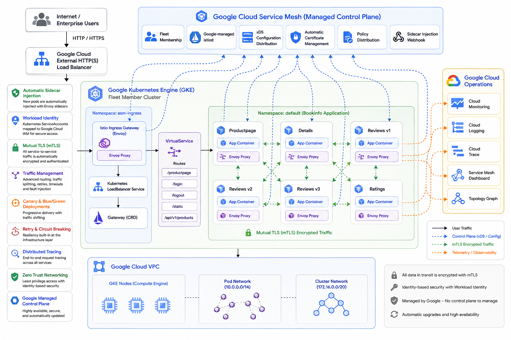
</p>

The baseline deployment begins with an unmanaged multi-service architecture where applications manage their own inter-service calls over unencrypted, unobserved internal cluster networks.

<p align="center">
  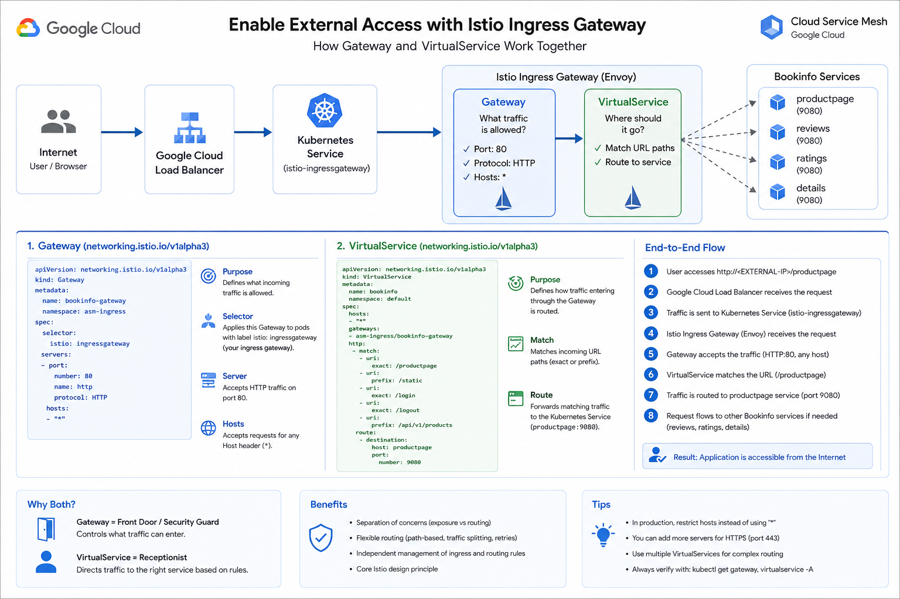
</p>

By integrating **Cloud Service Mesh**, traffic entering the cluster is intercepted at an **Istio Ingress Gateway** deployed in an isolated namespace (`asm-ingress`). Dynamic traffic routing rules specified in Kubernetes `VirtualService` manifests forward requests to the multi-version `Bookinfo` application (`productpage`, `details`, `reviews` v1/v2/v3, and `ratings`). Every workload Pod is injected with an **Envoy sidecar proxy** managed automatically by Google Cloud's Fleet-managed control plane.

---

## Business Problem

Modern enterprise organizations migrating monolithic systems to GKE microservices face critical operational challenges:

• **Security Compliance Deficits**: Inter-service ("east-west") communication across cluster namespaces defaults to unencrypted HTTP, failing strict zero-trust security audits.
• **Application Code Bloat**: Developers waste engineering cycles embedding custom retry logic, circuit breaking, mTLS certificate handling, and metrics export inside application codebases.
• **Unpredictable Release Risk**: Routing traffic to new software versions (canary or blue-green releases) requires hazardous DNS updates or manual service target re-configurations.
• **Observability Blindspots**: Operations teams lack unified topology graphs, standardized HTTP error tracking, and latency metrics across polyglot microservice environments written in Python, Java, Node.js, and Ruby.

---

## Solution Overview

Google **Cloud Service Mesh (CSM)** addresses these requirements by offloading networking concerns to a dedicated infrastructure layer:

• **Managed Control Plane**: Google handles the provisioning, upgrading, scaling, and maintenance of the Istio control plane (`istiod`), eliminating master node operational burden.
• **Automated mTLS & Identity**: Workload Identity binds Kubernetes ServiceAccounts to Google Cloud IAM, establishing mutual TLS (mTLS) authentication automatically across all pod communications.
• **Declarative Traffic Management**: Fine-grained HTTP routing, traffic splitting, and edge load balancing are configured using custom resource definitions (`Gateway`, `VirtualService`).
• **Out-of-the-Box Observability**: HTTP telemetry, latency profiles, and dependency visualizers are automatically ingested into Google Cloud Observability and the Service Mesh dashboard.

---

## Reference Architecture

✦ **Google Kubernetes Engine (GKE)**

Google Kubernetes Engine (GKE) is Google's managed Kubernetes platform ([docs](https://cloud.google.com/kubernetes-engine/docs)). It abstracts away control plane operations while allowing platform teams to orchestrate containerized workloads securely at scale.

✦ **Google Cloud Service Mesh (CSM)**

Cloud Service Mesh is Google's managed service mesh product ([docs](https://cloud.google.com/service-mesh/docs)). It delivers enterprise-grade security, traffic management, and telemetry without requiring teams to manage Istio control plane binaries.

✦ **Virtual Private Cloud (VPC)**

Google Cloud VPC provides underlying managed network isolation ([docs](https://cloud.google.com/vpc/docs)) for GKE nodes, cluster pod CIDRs, and external LoadBalancer IP allocation.

### Enterprise Use Cases
• **Zero-Trust Network Architecture**: Automatic mTLS encryption for all inter-service communication.
• **Polyglot Microservices Orchestration**: Standardized telemetry across multi-language microservices without code modification.
• **Advanced Traffic Steering**: Percent-based canary rollouts and fault injection testing.

---

## Design Decisions & Trade-offs

| Architectural Decision | Chosen Approach | Alternative Considered | Engineering Rationale & Trade-offs |
|---|---|---|---|
| **Control Plane Management** | **Managed Cloud Service Mesh** (`gcloud container fleet mesh`) | Self-Managed In-Cluster Istiod | **Chosen**: Eliminates control plane maintenance, master node scaling, and patch management overhead. **Trade-off**: Requires dependency on Google Cloud Fleet release channels (Regular/Rapid/Stable). |
| **Ingress Pattern** | **Isolated Ingress Namespace** (`asm-ingress`) | In-Cluster Control Plane Ingress | **Chosen**: Separates platform entry point from system control plane workloads, preventing credential exposure and enforcing strict RBAC boundaries. |
| **Sidecar Injection Strategy** | **Revision-Based Auto Injection** (`istio.io/rev=asm-managed`) | Manual Proxy Injection (`istioctl kube-inject`) | **Chosen**: Ensures all newly created pods in labeled namespaces automatically receive sidecar proxies during deployment. **Trade-off**: Requires pod restart to update existing workloads. |
| **Service Telemetry** | **Native Cloud Mesh Ingestion** | Custom Prometheus / Grafana Stack | **Chosen**: Zero-config telemetry pipeline direct to Google Cloud console with built-in SLO tracking and topology graphs. |

---

## Prerequisites

Before executing this lab, ensure you have access to:

• A **Google Cloud Platform** project with `roles/owner` or equivalent privileges (`Kubernetes Engine Admin`, `GKE Hub Admin`, `Service Account Admin`).
• **Google Cloud Shell** or a local terminal equipped with:
  - `gcloud` CLI (authenticated)
  - `kubectl` CLI
  - `siege` HTTP load generator utility

---

## Repository Structure

```
.
├── app-manifests/
│   └── bookinfo.yaml       # Microservices application deployment (productpage, details, reviews v1/v2/v3, ratings)
├── config-manifests/
│   ├── asm-ingress.yaml    # Istio Ingress Gateway deployment, Service, HPA, and PDB definitions
│   ├── gateway.yaml        # Istio Gateway resource defining external HTTP entry on port 80
│   └── virtualservice.yaml # Istio VirtualService routing rule directing traffic to productpage
├── images/                 # Architecture diagrams, visual validation screenshots, and interactive UI assets
└── README.md               # Enterprise Platform Architecture Documentation
```
<p align="center">
  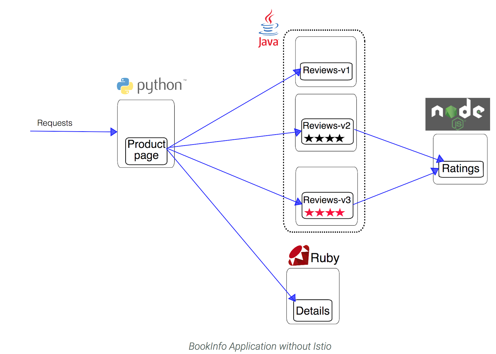
</p>
---

## Environment Variables

Execute the following script block to initialize standard shell variables required across all deployment phases:

```bash
# Export active project configuration and mesh parameters
export PROJECT_ID=$(gcloud config get-value project)
export PROJECT_NUMBER=$(gcloud projects describe ${PROJECT_ID} --format="value(projectNumber)")
export CLUSTER_NAME="central"
export CLUSTER_REGION="europe-west1"
export WORKLOAD_POOL="${PROJECT_ID}.svc.id.goog"
export MESH_ID="proj-${PROJECT_NUMBER}"
export GATEWAY_NS="asm-ingress"
```

---

## Implementation

### Task 1: Complete  Setup & Governance Verification

Establish project credentials, verify IAM administrative roles, and attach cluster credentials to the local `kubectl` context.

```bash
# Enable the Cloud Service Mesh API
gcloud services enable mesh.googleapis.com --project=$PROJECT_ID

# Verify active account possesses necessary administrative role
gcloud projects get-iam-policy $PROJECT_ID \
    --flatten="bindings[].members" \
    --filter="bindings.members:user:$(gcloud config get-value core/account 2>/dev/null)"
```

<p align="center">
  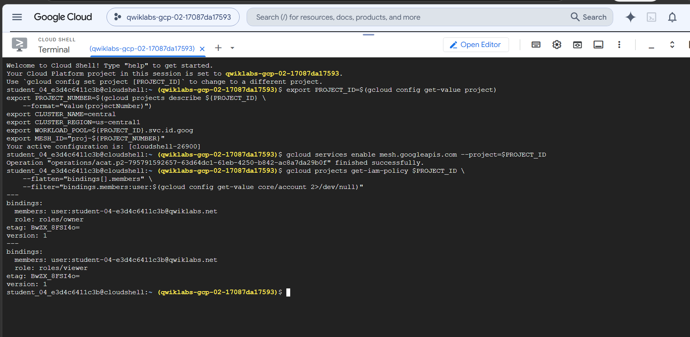
</p>

```bash
# Fetch GKE cluster credentials for kubectl context
gcloud container clusters get-credentials ${CLUSTER_NAME} \
    --zone $CLUSTER_REGION \
    --project $PROJECT_ID
```

<p align="center">
  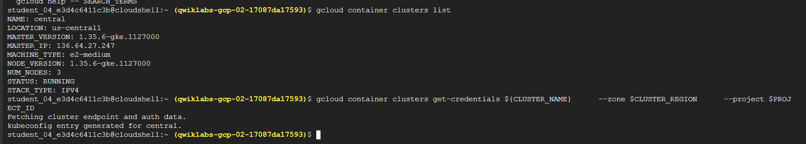
</p>

```bash
# Create cluster role binding granting administrative access to user
kubectl create clusterrolebinding cluster-admin-binding \
    --clusterrole=cluster-admin \
    --user=$(whoami)@qwiklabs.net
```

<p align="center">
  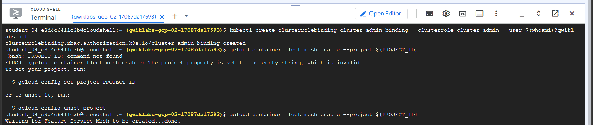
</p>

---

### Task 2: Prepare & Provision Managed Cloud Service Mesh

Enable the Cloud Service Mesh Fleet feature and request automatic control plane management for the target GKE cluster.

```bash
# Enable GKE Service Mesh Fleet for the project
gcloud container fleet mesh enable --project=${PROJECT_ID}

# Register cluster membership and set management to automatic
gcloud container fleet mesh update \
    --management automatic \
    --memberships ${CLUSTER_NAME}

# Monitor control plane provisioning state
watch -g "gcloud container fleet mesh describe | grep 'code: REVISION_READY'"
```

> [!NOTE]
> Managed Cloud Service Mesh control plane provisioning takes approximately 5 to 10 minutes. Wait until `REVISION_READY` is displayed before deploying ingress or workload manifests.

```bash
# Verify detailed Fleet mesh status
gcloud container fleet mesh describe

# Inspect active control plane revisions inside the cluster
kubectl get controlplanerevision -n istio-system
```

---

### Task 3: Deploy & Configure Cloud Service Mesh Ingress Gateway

Deploy an Envoy-based Ingress Gateway into a dedicated namespace to serve as the edge load balancer for incoming HTTP traffic.

```bash
# Create isolated namespace for ingress workloads
kubectl create namespace $GATEWAY_NS

# Apply managed revision label and enable sidecar injection
kubectl label namespace $GATEWAY_NS istio.io/rev=asm-managed --overwrite
kubectl label namespace $GATEWAY_NS istio-injection=enabled
```

<p align="center">
  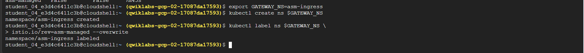
</p>

```bash
# Inspect namespace labels
kubectl describe ns $GATEWAY_NS
```

<p align="center">
  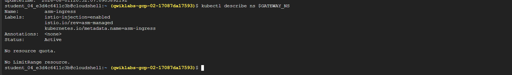
</p>

```bash
# Ensure target configuration directory exists
mkdir -p config-manifests

# Define and store Ingress Gateway resources in config-manifests/asm-ingress.yaml
cat <<'EOF' > config-manifests/asm-ingress.yaml
apiVersion: v1
kind: ServiceAccount
metadata:
  name: istio-ingressgateway
  namespace: asm-ingress

---
apiVersion: v1
kind: Service
metadata:
  name: istio-ingressgateway
  namespace: asm-ingress
  labels:
    app: istio-ingressgateway
    istio: ingressgateway
spec:
  ports:
    - name: status-port
      port: 15021
      protocol: TCP
      targetPort: 15021
    - name: http2
      port: 80
    - name: https
      port: 443
  selector:
    istio: ingressgateway
    app: istio-ingressgateway
  type: LoadBalancer

---
apiVersion: rbac.authorization.k8s.io/v1
kind: Role
metadata:
  name: istio-ingressgateway
  namespace: asm-ingress
rules:
  - apiGroups: [""]
    resources: ["secrets"]
    verbs: ["get", "watch", "list"]

---
apiVersion: rbac.authorization.k8s.io/v1
kind: RoleBinding
metadata:
  name: istio-ingressgateway
  namespace: asm-ingress
roleRef:
  apiGroup: rbac.authorization.k8s.io
  kind: Role
  name: istio-ingressgateway
subjects:
  - kind: ServiceAccount
    name: istio-ingressgateway

---
apiVersion: policy/v1
kind: PodDisruptionBudget
metadata:
  name: istio-ingressgateway
  namespace: asm-ingress
spec:
  maxUnavailable: 1
  selector:
    matchLabels:
      istio: ingressgateway
      app: istio-ingressgateway

---
apiVersion: apps/v1
kind: Deployment
metadata:
  name: istio-ingressgateway
  namespace: asm-ingress
spec:
  replicas: 1
  selector:
    matchLabels:
      app: istio-ingressgateway
      istio: ingressgateway
  template:
    metadata:
      annotations:
        inject.istio.io/templates: gateway
      labels:
        app: istio-ingressgateway
        istio: ingressgateway
    spec:
      containers:
        - name: istio-proxy
          image: auto
      serviceAccountName: istio-ingressgateway

---
apiVersion: autoscaling/v2
kind: HorizontalPodAutoscaler
metadata:
  name: istio-ingressgateway
  namespace: asm-ingress
spec:
  maxReplicas: 5
  metrics:
    - type: Resource
      resource:
        name: cpu
        target:
          type: Utilization
          averageUtilization: 80
  minReplicas: 3
  scaleTargetRef:
    apiVersion: apps/v1
    kind: Deployment
    name: istio-ingressgateway
EOF

# Apply Gateway Deployment manifest from config-manifests/
kubectl apply -f config-manifests/asm-ingress.yaml
```

<p align="center">
  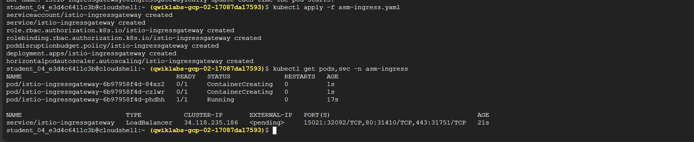
</p>

```bash
# Verify Gateway pod status and external LoadBalancer IP assignment
kubectl get pod,service -n asm-ingress
```

<p align="center">
  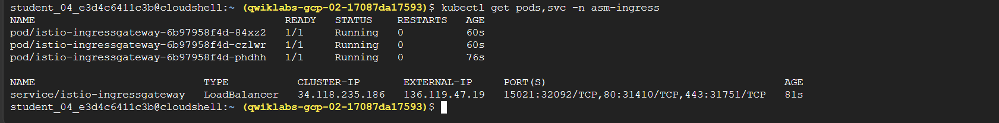
</p>

```bash
# Enable auto sidecar injection on the default application namespace
kubectl label namespace default istio.io/rev=asm-managed --overwrite
kubectl label namespace default istio-injection=enabled
```

<p align="center">
  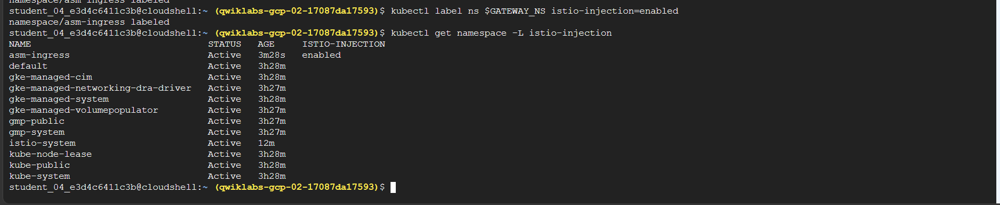
</p>

```bash
# Confirm default namespace labels
kubectl describe ns default
```

<p align="center">
  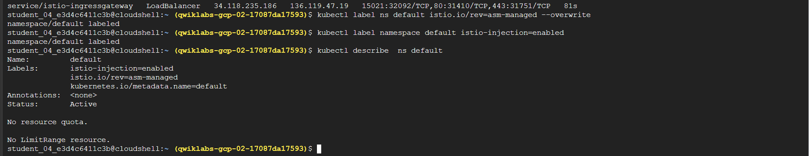
</p>

---

### Task 4: Deploy & Configure Multi-Service Application (Bookinfo)

Deploy the polyglot Bookinfo microservices application manifest from `app-manifests/bookinfo.yaml` into the sidecar-enabled namespace.

```bash
# Apply Bookinfo microservices application manifests from app-manifests/
kubectl apply -f app-manifests/bookinfo.yaml
```

<p align="center">
  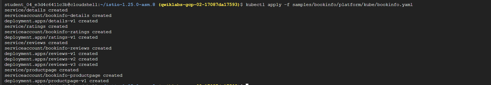
</p>

---

### Task 5: Enable External Ingress & Route Management

Configure the Istio `Gateway` resource in `config-manifests/gateway.yaml` to accept HTTP port 80 traffic and construct a `VirtualService` in `config-manifests/virtualservice.yaml` to route URIs (`/productpage`, `/static`, `/login`, `/logout`, `/api/v1/products`) to the `productpage` service.

```bash
# Create Istio Gateway resource manifest in config-manifests/gateway.yaml
cat <<'EOF' > config-manifests/gateway.yaml
apiVersion: networking.istio.io/v1alpha3
kind: Gateway
metadata:
  name: bookinfo-gateway
  namespace: asm-ingress
spec:
  selector:
    istio: ingressgateway
  servers:
  - port:
      number: 80
      name: http
      protocol: HTTP
    hosts:
    - "*"
EOF

kubectl apply -f config-manifests/gateway.yaml
```

<p align="center">
  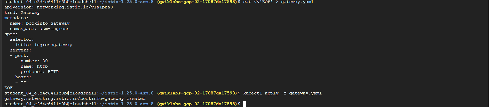
</p>

```bash
# Create VirtualService routing rules manifest in config-manifests/virtualservice.yaml
cat <<'EOF' > config-manifests/virtualservice.yaml
apiVersion: networking.istio.io/v1alpha3
kind: VirtualService
metadata:
  name: bookinfo
spec:
  hosts:
  - "*"
  gateways:
  - asm-ingress/bookinfo-gateway
  http:
  - match:
    - uri:
        exact: /productpage
    - uri:
        prefix: /static
    - uri:
        exact: /login
    - uri:
        exact: /logout
    - uri:
        prefix: /api/v1/products
    route:
    - destination:
        host: productpage
        port:
          number: 9080
EOF

kubectl apply -f config-manifests/virtualservice.yaml
```

<p align="center">
  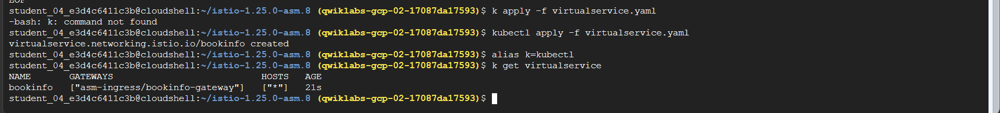
</p>

```bash
# Confirm active VirtualService bindings
kubectl get virtualservices
```

---

## Validation

### Cluster-Internal Pod-to-Pod Connectivity

Verify microservice deployments and validate internal mesh routing by dispatching a `curl` request directly from the `ratings` pod container to the `productpage` service.

```bash
# Check all deployed services and microservice pods
kubectl get services
kubectl get pods
```

<p align="center">
  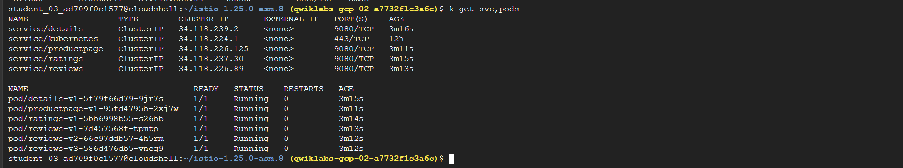
</p>

<p align="center">
  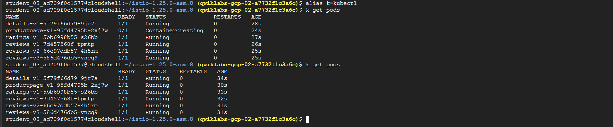
</p>

> [!TIP]
> Ensure all pods indicate `2/2 READY`, confirming that both the application container and the Envoy proxy sidecar are fully initialized.

```bash
# Execute internal mesh verification curl from ratings container to productpage
kubectl exec -it $(kubectl get pod -l app=ratings -o jsonpath='{.items[0].metadata.name}') \
  -c ratings -- curl productpage:9080/productpage | grep -o "<title>.*</title>"
```

<p align="center">
  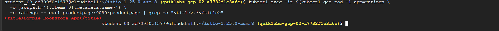
</p>

---

### External Ingress Gateway Reachability

Extract the external IP address of the `istio-ingressgateway` LoadBalancer and send an HTTP GET request to validate external edge connectivity.

```bash
# Retrieve External IP of ingress gateway
export GATEWAY_URL=$(kubectl get svc istio-ingressgateway -n asm-ingress -o jsonpath='{.status.loadBalancer.ingress[0].ip}')
echo "Gateway External IP: ${GATEWAY_URL}"

# Send HTTP request from outside the cluster
curl -I http://${GATEWAY_URL}/productpage
```

<p align="center">
  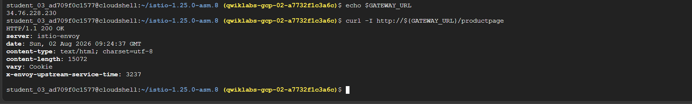
</p>

---

### End-to-End Application UI Execution

Open `http://${GATEWAY_URL}/productpage` in a web browser to verify full microservice rendering.

<p align="center">
  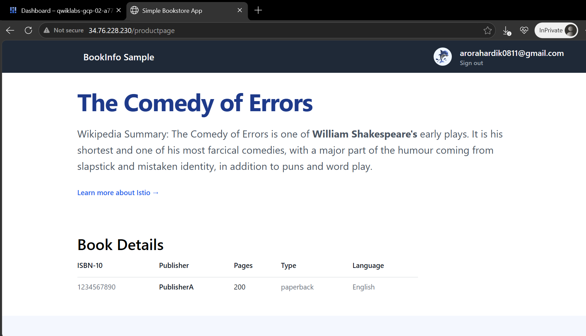
</p>

<p align="center">
  
</p>

---

## Observability

### Cloud Service Mesh Dashboard & Service Metrics

Cloud Service Mesh automatically collects telemetry for all HTTP(S) traffic flowing through Envoy sidecars and streams metrics directly to the Google Cloud console.

1. Navigate to **Kubernetes Engine > Service Mesh** in the Cloud Console.
2. Select the `productpage` service to inspect:
   - **Request Rates & Error Rates**: Real-time HTTP 2xx/4xx/5xx breakdown.
   - **Latency Profiles**: Median (p50), 95th, and 99th percentile response timings.
   - **Resource Utilization**: CPU and Memory consumption per microservice version.
3. Access **Connected Services** to inspect inbound and outbound dependency chains and confirm mTLS status across inter-service links.

### Visualizing Mesh Topology & Traffic Slicing

To analyze mesh communication visually and simulate production traffic:

```bash
# Install siege load generator utility in Cloud Shell
sudo apt-get install -y siege

# Generate continuous background load against the ingress gateway
siege http://${GATEWAY_URL}/productpage
```

Within the console **Service Mesh > Topology** view, review the live network flow graph. Platform engineers can observe round-robin load distribution across `reviews-v1` (no stars), `reviews-v2` (black stars), and `reviews-v3` (red stars) driven by default GKE Service Mesh traffic policies.

---

## Troubleshooting

### Deep-Dive Incident Investigation: Ingress Gateway `ImagePullBackOff`

During mesh provisioning, deploying the `config-manifests/asm-ingress.yaml` manifest may result in the gateway pod failing to start, bound in an `ImagePullBackOff` loop.

#### 1. Symptoms
• `curl http://${GATEWAY_URL}/productpage` fails with `Connection refused`, followed later by `503 Service Unavailable`.
• Ingress gateway pods in `asm-ingress` namespace remain in `ImagePullBackOff` state.

#### 2. Root Cause Discovery
Inspecting the failed pod manifest via `kubectl describe` reveals:

```text
Events:
  Type     Reason     Age                  From               Message
  ----     ------     ----                 ----               -------
  Normal   Scheduled  2m                   default-scheduler  Successfully assigned asm-ingress/istio-ingressgateway-5894744dbd-zxlgc to gke-central-node-1
  Normal   Pulling    1m (x2 over 2m)      kubelet            Pulling image "auto"
  Warning  Failed     1m (x2 over 2m)      kubelet            Failed to pull image "auto": rpc error: code = Unknown desc = failed to pull and unpack image "docker.io/library/auto:latest": failed to resolve reference
  Warning  Failed     1m (x2 over 2m)      kubelet            Error: ErrImagePull
```

The image key is specified literally as `image: auto`. This string is an **injector placeholder value**, designed to be intercepted and mutated dynamically by the Cloud Service Mesh mutating webhook during pod creation.

#### 3. Diagnostic Traceback
Executing diagnostic commands across the control plane reveals the missing webhook pipeline:

```bash
# 1. Check for active Istio/ASM mutating webhooks
kubectl get mutatingwebhookconfigurations
# Output: No ASM/Istio mutating webhooks registered in the cluster.

# 2. Check Fleet control plane status
gcloud container fleet mesh describe
# Output: code: REVISION_PROVISIONING

# 3. Check ControlPlaneRevision custom resources
kubectl get controlplanerevision -n istio-system
# Output: RECONCILED=False

# 4. Check for in-cluster control plane pods
kubectl get pods -n istio-system
# Output: No resources found in istio-system namespace.
```

#### 4. Diagnosis
The managed Cloud Service Mesh control plane had **not finished provisioning** when the ingress gateway manifest was applied. Because the mutating admission webhook did not yet exist:
- The pod manifest was passed to the Kubernetes scheduler un-mutated.
- The kubelet attempted to pull the literal image string `docker.io/library/auto:latest`.
- Docker Registry rejected `auto`, causing `ImagePullBackOff`.

#### 5. Resolution & Recovery Sequence
Wait for the managed control plane initialization to complete fully before deploying workloads or restarting pods:

```bash
# 1. Wait for control plane state REVISION_READY and RECONCILED=True
gcloud container fleet mesh describe | grep "code: REVISION_READY"

# 2. Delete the stalled ingress gateway pod to trigger recreation
kubectl delete pod -n asm-ingress -l app=istio-ingressgateway

# 3. Verify pod mutation succeeded and gateway reaches Running status
kubectl get pods -n asm-ingress
# Output: pod/istio-ingressgateway-5894744dbd-zxlgc   1/1   Running   0   12s
```

#### 6. Transient `503 Service Unavailable` Routing Stabilization
Once the gateway pod reaches `1/1 Running`, immediate `curl` requests may return:

```http
HTTP/1.1 503 Service Unavailable
date: Sun, 02 Aug 2026 15:00:00 GMT
server: istio-envoy
```

This HTTP 503 error confirms that the Envoy proxy container is up and running, but its cluster dynamic routing table has not finished synchronizing with the control plane and target workload endpoints.

#### 7. Final Resolution Verification
After waiting 30–60 seconds for endpoint reconciliation:

```bash
curl -I http://${GATEWAY_URL}/productpage
```

```http
HTTP/1.1 200 OK
content-type: text/html; charset=utf-8
content-length: 4183
server: istio-envoy
```

> [!WARNING]
> **Key Architectural Takeaway**: In Google Cloud Service Mesh, specifying `image: auto` is standard practice. If pods encounter `ImagePullBackOff` on `auto`, **do not modify the manifest image field**. The root cause is that the managed control plane and admission mutating webhook are still in `REVISION_PROVISIONING`. Always verify `REVISION_READY` status before initiating workload deployments or proxy injection.

---

## Cleanup

To prevent ongoing resource billing after completing the lab, destroy all provisioned GKE components and fleet resources:

```bash
# Delete application routing and workload manifests
kubectl delete -f config-manifests/virtualservice.yaml
kubectl delete -f config-manifests/gateway.yaml
kubectl delete -f app-manifests/bookinfo.yaml

# Delete ingress gateway resources and namespaces
kubectl delete -f config-manifests/asm-ingress.yaml
kubectl delete namespace asm-ingress

# Disable GKE Service Mesh Fleet feature
gcloud container fleet mesh disable --project=${PROJECT_ID}
```
